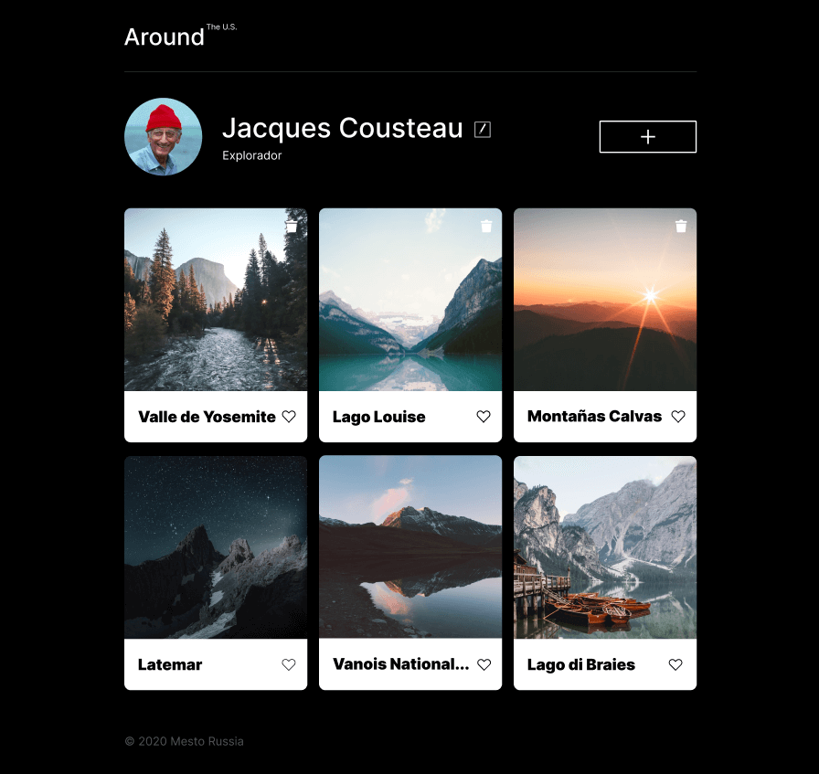

# Tripleten web_project_around

# Proyecto realizado en el bootcamp de desarrollo web de Tripleten. Utiliza HTML, CSS, JS y React. El proyecto fue realizado en VSS (Visual Studio Code).

## ¿De qué se trata?

### Se creó una página interactiva similar a una red social donde los usuarios pueden añadir, eliminar y dar like a fotos, así como editar su nombre de usuario e información personal a través de una API.

## El proyecto se adapta a las siguientes resoluciones:

1. 1280px Desktop

2. 800px Tablet

3. 320px Mobile

## Preview del proyecto:

## Aprendizaje:

### Este es mi primer proyecto usando React, en el cual se empleó el uso de hooks para la funcionalidad de la página, además de asincronía con conexión a una API.

## Detalles del código

### El proyecto está estructurado en componentes de React. A continuación, se describen las partes más relevantes:

### Estructura de componentes:

#### App: Componente principal que gestiona el estado de la aplicación y la lógica de los popups.

#### Header: Componente que muestra el encabezado de la aplicación.

#### Main: Componente que presenta las tarjetas de fotos y la lógica de interacción.

#### Footer: Componente que muestra el pie de página.

#### Popups: Componentes modales para editar perfil, añadir nuevas fotos, editar avatar y confirmar la eliminación de tarjetas.

#### Gestión del Estado:

### Utilizo el hook useState de React para manejar el estado de la información del usuario, las tarjetas y la apertura/cierre de popups.

### La información del usuario se carga de manera asincrónica utilizando api.getUserInfo(), y las tarjetas se gestionan a través de api.getInitialCards().

### Interacciones:

### Funciones para añadir, eliminar y dar "like" a las tarjetas, utilizando métodos de la API.

### Validaciones en los formularios de entrada para asegurar que los datos sean correctos antes de enviarlos a la API.

## Link de Github pages para visualizar mi página: https://luis-gn006.github.io/web_project_around_react

# © Luis Gonzalez

# Espero que disfruten de este proyecto tanto como disfruté haciéndolo. ¡Saludos!
