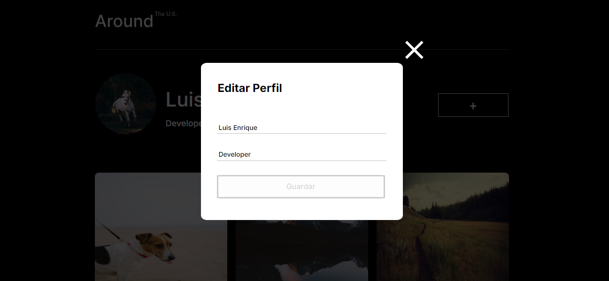

# Tripleten web_project_around

# Proyecto realizado en el bootcamp de desarrollo web de Tripleten. Realizado con HTML, CSS, JS y React. El proyecto fue realizado en VSS (Visual Studio Code)

## ¿De qué se trata?

### Se realizó una página interactiva con semejanza a una red social. El usuario puede añadir, eliminar o dar like a las fotos, al igual que editar su nombre de usuario e información acerca de sí mismo, todo esto a través de una API.

## El proyecto se adapta en las siguientes resoluciones:

1. 1280px Desktop

2. 800px Tablet

3. 320px Mobile

## Preview del Proyecto:

## Aprendizaje:

### Estes es mi primer poryecto usando JS en el cual se empleo POO, asincronia con conexion a una API. Tambien se uso Webpack para el empaquetado del proeycto. Hubo muchos procesos de refactorizacion para poner en practica clases y practivas más avanzadas de JS.El nuevo reto fue realizar todo esto en React.

## Link de Github pages para visualizar mi pagina: https://luis-gn006.github.io/web_project_around_react

# © Luis Gonzalez

# Espero que disfruten de este proyecto tanto como disfrute haciéndolo. ¡Saludos!
